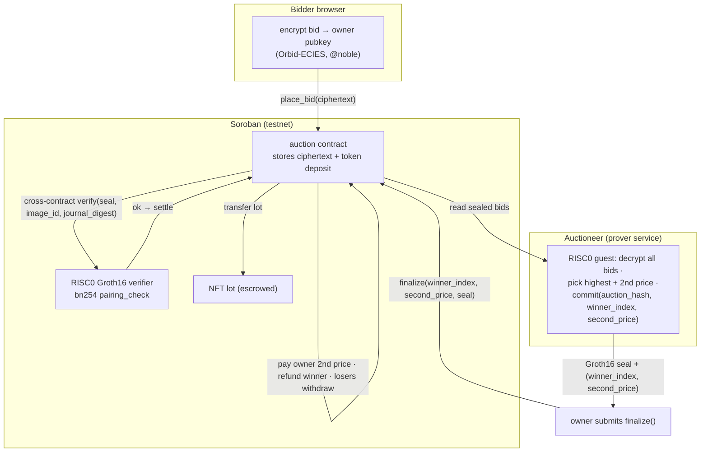

# Orbid - Sealed-Bid Vickrey Auctions on Stellar, Settled by Proof

> Submission for **Stellar Hacks: Real-World ZK**. A trustless sealed-bid NFT auction where the auctioneer is *forced* by a zero-knowledge proof to settle on the correct winner at the correct price - without ever revealing a single bid amount.

## The problem ZK actually solves here

In a sealed-bid auction the auctioneer **sees every bid**. That's the whole trust problem:

- They could declare the wrong winner.
- In a second-price (Vickrey) auction they could **fake the second price** to overcharge the winner.
- Losing bidders have no way to check any of it.

Orbid removes that trust. The auctioneer still decrypts the bids privately, but to settle they must produce a **RISC0 zk-proof** that the winner and the price were computed correctly **over exactly the bids posted on-chain**. The contract verifies the proof natively (BN254 Groth16, Stellar Protocol 25). The proof discloses **only the settlement price** (what the winner pays) - every bid amount, *including the winner's own*, stays sealed forever.

This is ZK doing work nothing else can: proving a correct computation over private inputs. No mixer, no anonymity set, no privacy theater.

## Why Vickrey (second-price)

Sealed-bid, winner pays the **second-highest** bid. Bidding your true value is optimal, and - crucially for the demo - the proof reveals the second price (it has to; it's what's paid) while keeping the winning bid itself secret. That's the strongest possible "ZK is load-bearing" story.

## Architecture



**The load-bearing link:** `finalize` takes an owner-supplied `winner_index` + `second_price`, but binds them into the proof journal alongside an `auction_hash` that the **contract recomputes from its own stored bids** (+ reserve + deposit). The winner's *address* is resolved from `bids[winner_index]` - never trusted from the owner. So the auctioneer cannot drop/add/reorder/alter bids, or lie about the winner or the price: any of those produces a journal that the proof does not attest to, and verification reverts.

## Repository layout

| Path | What |
|---|---|
| `auction/core` | Orbid-ECIES (k256 ECDH → HKDF-SHA256 → AES-256-GCM) + Vickrey `run_auction` + journal layout. Shared by guest, host, server. |
| `auction/methods/guest` | RISC0 zkVM guest - the program whose execution is proven. |
| `auction/host` | Dev tool: evaluate a vector, measure cycles, emit a Groth16 seal. |
| `auction/server` | Owner-side prover (Axum). `POST /api/v1/generate-proof`. Holds the secp256k1 key; local or Bonsai. |
| `soroban/contracts/auction` | The auction lifecycle + on-chain proof verification + settlement. |
| `soroban/contracts/nft` | Minimal NFT for lots. |
| `soroban/contracts/token` | Mock SEP-41 token (open faucet) - deployed as USDC (7dp) and USDT (6dp). Native XLM (SAC) is also selectable. The seller picks the payment token **per auction**; the UI reads each token's `decimals()` from chain. |
| `risc0-verifier` | Vendored RISC0 Groth16 verifier (NethermindEth/stellar-risc0-verifier), called by the auction contract. |
| `interop` | `@noble` encryptor - proves the JS bid encryption matches the Rust guest byte-for-byte. |
| `frontend` | Next.js 15 UI (gallery, sealed bid, owner reveal, claim). |
| `scripts/e2e.sh` | Deploy everything + full lifecycle with a real proof on testnet. |

## Tech

RISC0 zkVM 3.0 (Groth16 over BN254) · Soroban SDK 26 · Stellar Protocol 25 native `bn254` host functions · secp256k1/HKDF/AES-256-GCM (RISC0 `k256`/`sha2` precompiles) · Next.js 15 + Freighter.

## Verified end-to-end on testnet

`scripts/e2e.sh` deploys the contracts, places 3 real encrypted bids, generates a real Groth16 proof, and finalizes on-chain. Last run: bids `[100, 70, 50]` → winner = bidder 0, settled at the **second price 70**, NFT transferred to the winner. Finalize tx [`4abf3b2d…`](https://stellar.expert/explorer/testnet/tx/4abf3b2ddd83c8539695f0a99cc4eadfadcc0929114b80f2f9f4d2a597d7f3c7). Deployed addresses live in `soroban/deployment.json`.

## Running it

```bash
# 1. Build + test the zk compute layer
cd auction && cargo test -p auction-core
VECTOR=../interop/vector.json cargo run -p auction-host --release   # execute-only (fast)

# 2. Soroban contract tests
cd ../soroban && cargo test

# 3. Full deploy + on-chain proof E2E (needs Docker for proving, ~3 min)
cd .. && bash scripts/e2e.sh

# 4. Owner prover service (holds the secp256k1 key)
cd auction && ORBID_OWNER_SK=<hex32> cargo run -p auction-server --release
#   set BONSAI_API_KEY + BONSAI_API_URL to prove remotely instead of locally

# 5. Frontend
cd ../frontend && pnpm install && pnpm dev
```

## Honest limitations

- **Owner-key collusion.** Bids are encrypted to a single auctioneer key; a malicious auctioneer could leak the key to a favored bidder to peek at others' bids. Mitigation (out of scope): threshold/MPC decryption keys or timed commitments.
- **Bonsai trust.** If proving runs on RISC0's hosted Bonsai service, the guest's private inputs (owner key + ciphertexts) are sent to Bonsai, which could decrypt the bids. Local proving keeps them on the owner's machine.
- **Exact-match, not fuzzy.** The auction binds the exact ciphertext set; this is a clean cryptographic model, not a real-world KYC/identity layer.
- **Demo scope.** Mock USDC/USDT (open faucet) + native XLM + minimal NFT, testnet only. Proving is ~3 min locally per auction; bid count is bounded by proving time.

Nothing is reported as working that wasn't actually run - every claim above is backed by a test or an on-chain transaction.
