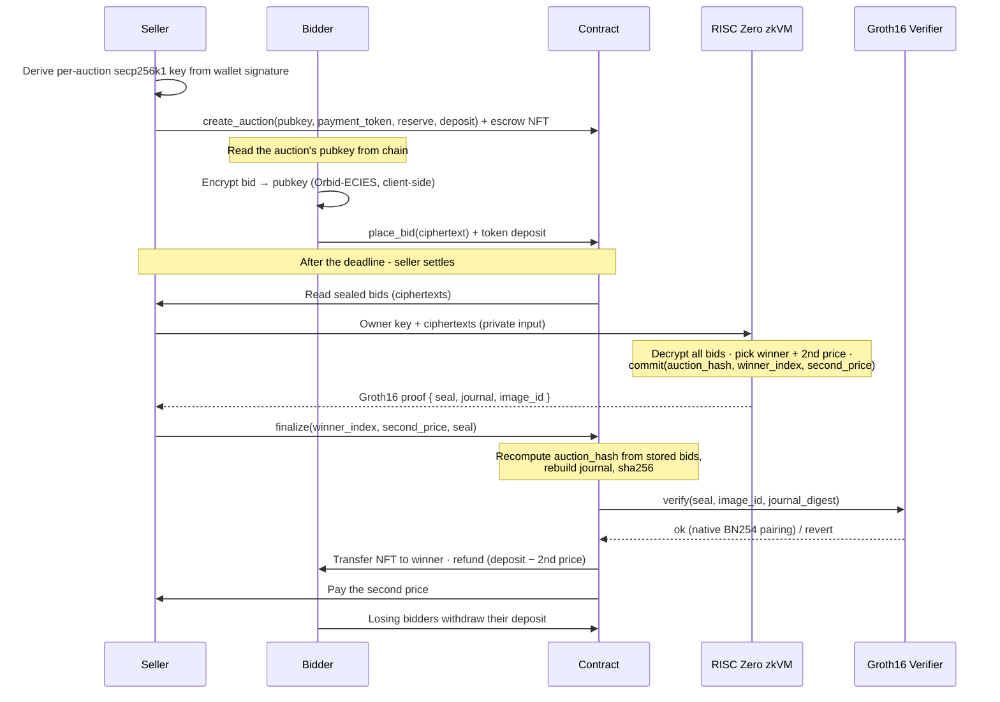

# Orbid - Sealed-Bid Vickrey Auctions on Stellar, Settled by Proof

> Submission for **Stellar Hacks: Real-World ZK**. A trustless sealed-bid NFT auction where the auctioneer is *forced*
> by a zero-knowledge proof to settle on the correct winner at the correct price - without ever revealing a single bid
> amount.

## The problem ZK actually solves here

In a sealed-bid auction the auctioneer **sees every bid**. That's the whole trust problem:

- They could declare the wrong winner.
- In a second-price (Vickrey) auction they could **fake the second price** to overcharge the winner.
- Losing bidders have no way to check any of it.

Orbid removes that trust. The auctioneer still decrypts the bids privately, but to settle they must produce a **RISC0
zk-proof** that the winner and the price were computed correctly **over exactly the bids posted on-chain**. The contract
verifies the proof natively (BN254 Groth16, Stellar Protocol 27). The proof discloses **only the settlement price** (
what the winner pays) - every bid amount, *including the winner's own*, stays sealed forever.

This is ZK doing work nothing else can: proving a correct computation over private inputs. No mixer, no anonymity set,
no privacy theater.

It's **selective disclosure, not anonymity**: the proof reveals exactly the one fact a settlement needs to be auditable -
the clearing price - and nothing else. Everyone can verify the auction was settled honestly without anyone learning what
was bid. That's the compliance-friendly shape of privacy (prove the rule was followed, disclose only what's required),
not the hide-everything kind.

## Why Vickrey (second-price)

Sealed-bid, winner pays the **second-highest** bid. Bidding your true value is optimal, and - crucially for the demo -
the proof reveals the second price (it has to; it's what's paid) while keeping the winning bid itself secret. That's the
strongest possible "ZK is load-bearing" story.

## Architecture



**The load-bearing link:** `finalize` takes an owner-supplied `winner_index` + `second_price`, but binds them into the
proof journal alongside an `auction_hash` that the **contract recomputes from its own stored bids** (+ reserve +
deposit). The winner's *address* is resolved from `bids[winner_index]` - never trusted from the owner. So the auctioneer
cannot drop/add/reorder/alter bids, or lie about the winner or the price: any of those produces a journal that the proof
does not attest to, and verification reverts.

## Keys & privacy - nothing is stored

Bids are encrypted client-side with **Orbid-ECIES** (secp256k1 ECDH → HKDF-SHA256 → AES-256-GCM; a 77-byte wire), and
the same scheme runs byte-identically in JS (`@noble`) and the Rust guest.

Every key is **derived deterministically from a wallet signature**, never persisted:

- Each auction has its **own** secp256k1 keypair, derived from the *seller's* signature. The public key lives on-chain;
  the secret is re-derived only at reveal and handed to the prover - never stored in the browser or a database.
- Each *bidder* derives their own ephemeral key the same way. Because ECIES lets the sender recover their message, a
  bidder can re-derive their key to decrypt **their own** bid (handy in the UI) - but no one else's.
- The **auctioneer** can decrypt every bid - that is exactly the trust problem the proof neutralises, not a leak.

## Repository layout

| Path                                 | What                                                                                                                                                                                                                                                                                                                        |
|--------------------------------------|-----------------------------------------------------------------------------------------------------------------------------------------------------------------------------------------------------------------------------------------------------------------------------------------------------------------------------|
| `auction/core`                       | Orbid-ECIES (k256 ECDH → HKDF-SHA256 → AES-256-GCM) + Vickrey `run_auction` + journal layout. Shared by guest, host, server.                                                                                                                                                                                                |
| `auction/methods/guest`              | RISC0 zkVM guest - the program whose execution is proven.                                                                                                                                                                                                                                                                   |
| `auction/host`                       | Dev tool: evaluate a vector, measure cycles, emit a Groth16 seal.                                                                                                                                                                                                                                                           |
| `auction/server`                     | Owner-side prover (Axum). `POST /api/v1/generate-proof`. Holds the secp256k1 key; local or Bonsai.                                                                                                                                                                                                                          |
| `soroban/contracts/auction`          | The auction lifecycle + on-chain proof verification + settlement.                                                                                                                                                                                                                                                           |
| `soroban/contracts/nft`              | Minimal NFT for lots.                                                                                                                                                                                                                                                                                                       |
| `soroban/contracts/token`            | Mock SEP-41 token (open faucet) - deployed as USDC (7dp) and USDT (6dp). Native XLM (SAC) is also selectable. The seller picks the payment token **per auction**; the UI reads each token's `decimals()` from chain.                                                                                                        |
| `risc0-verifier`                     | Vendored RISC0 Groth16 verifier (NethermindEth/stellar-risc0-verifier), called by the auction contract.                                                                                                                                                                                                                     |
| `interop`                            | `@noble` encryptor - proves the JS bid encryption matches the Rust guest byte-for-byte.                                                                                                                                                                                                                                     |
| `frontend`                           | Next.js 15 UI (deep-space theme, Freighter): lot gallery with status filters + sort, sealed-bid form with live balance, per-auction key derivation, owner reveal/settle, bidder self-reveal of their own bid, "My activity" (listed/joined, via contract views), calendar/duration deadline picker, and share-to-bid links. |
| `scripts/e2e.sh` · `scripts/seed.sh` | Full deploy + real-proof lifecycle on testnet · seed demo lots (multi-token, real sealed bids).                                                                                                                                                                                                                             |

## Tech

- **RISC0 zkVM 3.0** - Groth16 proofs over BN254
- **Soroban SDK 26** - auction, NFT, and SEP-41 token contracts
- **Stellar Protocol 27** - native `bn254` pairing host functions for on-chain verification (testnet)
- **Orbid-ECIES** - secp256k1 / HKDF-SHA256 / AES-256-GCM (RISC0 `k256` + `sha2` precompiles)
- **Next.js 15 + Freighter** - client-side encryption and wallet signing

## Verified end-to-end on testnet

`scripts/e2e.sh` deploys the contracts, places 3 real encrypted bids, generates a real Groth16 proof, and finalizes
on-chain. Last run: bids `[100, 70, 50]` → winner = bidder 0, settled at the **second price 70**, NFT transferred to the
winner. Finalize tx [
`4abf3b2d…`](https://stellar.expert/explorer/testnet/tx/4abf3b2ddd83c8539695f0a99cc4eadfadcc0929114b80f2f9f4d2a597d7f3c7).
Deployed addresses live in `soroban/deployment.json`.

## Running it

```bash
# 1. Build + test the zk compute layer
cd auction && cargo test -p auction-core
VECTOR=../interop/vector.json cargo run -p auction-host --release   # execute-only (fast)

# 2. Soroban contract tests
cd ../soroban && cargo test

# 3. Full deploy + on-chain proof E2E (needs Docker for proving, ~3 min)
cd .. && bash scripts/e2e.sh

# 4. Owner prover service (holds the secp256k1 key)
cd auction && ORBID_OWNER_SK=<hex32> cargo run -p auction-server --release
#   set BONSAI_API_KEY + BONSAI_API_URL to prove remotely instead of locally

# 5. Frontend
cd ../frontend && pnpm install && pnpm dev
```

## Honest limitations

- **Owner-key collusion.** Bids are encrypted to a single auctioneer key; a malicious auctioneer could leak the key to a
  favored bidder to peek at others' bids. Mitigation (out of scope): threshold/MPC decryption keys or timed commitments.
- **Bonsai trust.** If proving runs on RISC0's hosted Bonsai service, the guest's private inputs (owner key +
  ciphertexts) are sent to Bonsai, which could decrypt the bids. Local proving keeps them on the owner's machine.
- **Exact-match, not fuzzy.** The auction binds the exact ciphertext set; this is a clean cryptographic model, not a
  real-world KYC/identity layer.
- **Deposit is a hard bid cap.** Bids are sealed, so the contract escrows one fixed deposit per wallet and ignores any
  bid above it (it would be unbacked). Bidders lock their ceiling up front, and the public deposit bounds the maximum
  bid - though the exact amounts stay sealed. A wallet bids once; re-bidding overwrites it (no second deposit).
- **Seller-controlled settlement (liveness).** Only the seller can `finalize`, and `withdraw` requires a settled
  auction - so a seller who dislikes the outcome can simply never settle, leaving bidder deposits escrowed
  indefinitely. It's a liveness hole, not a theft vector (no one else can take the funds). Mitigation (out of scope): a
  post-deadline escape hatch that lets bidders reclaim deposits if the seller never finalizes.
- **Demo scope.** Mock USDC/USDT (open faucet) + native XLM + minimal NFT, testnet only. Proving is ~3 min locally per
  auction; bid count is bounded by proving time.

Nothing is reported as working that wasn't actually run - every claim above is backed by a test or an on-chain
transaction.
